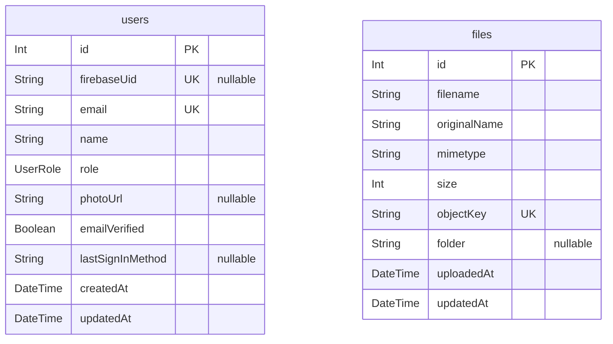

# Database Schema Documentation

> Generated by [`prisma-markdown`](https://github.com/samchon/prisma-markdown)

- [default](#default)

## default

### `users`

Properties as follows:

- `id`:
- `firebaseUid`:
- `email`:
- `name`:
- `role`:
- `photoUrl`:
- `emailVerified`:
- `lastSignInMethod`:
- `createdAt`:
- `updatedAt`:

### `files`

Properties as follows:

- `id`:
- `filename`:
- `originalName`:
- `mimetype`:
- `size`:
- `objectKey`:
- `folder`:
- `uploadedAt`:
- `updatedAt`:
