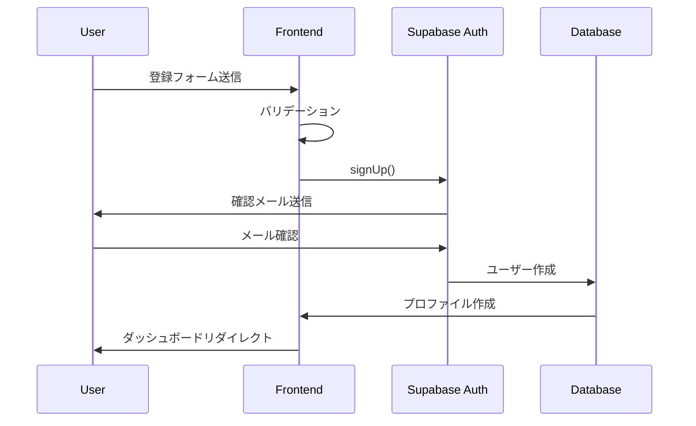
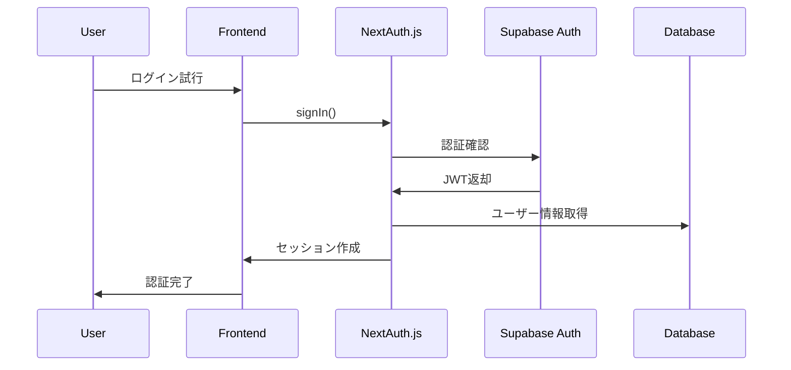

# 認証・ユーザー管理システム詳細設計書

## プロジェクト概要
- **プロジェクト名**: Hair - 美容院予約システム
- **Issue**: #5 認証・ユーザー管理システム
- **期間**: 3-4週間
- **担当**: フロントエンドエンジニア 1名 + バックエンドエンジニア 1名

## 1. システムアーキテクチャ

### 1.1 技術スタック
- **認証**: Supabase Auth + NextAuth.js
- **データベース**: Supabase PostgreSQL
- **ストレージ**: Supabase Storage
- **フロントエンド**: Next.js (想定)
- **セキュリティ**: JWT、Rate Limiting、CSRF保護

### 1.2 認証フロー設計

#### A. ユーザー登録フロー


#### B. ログインフロー


## 2. ロール管理システム

### 2.1 ロール定義
```typescript
enum UserRole {
  CUSTOMER = 'customer',
  STYLIST = 'stylist', 
  SALON_ADMIN = 'salon_admin',
  SYSTEM_ADMIN = 'system_admin'
}
```

### 2.2 権限マトリックス

| 機能 | Customer | Stylist | Salon Admin | System Admin |
|------|----------|---------|-------------|--------------|
| **予約管理** |
| 予約作成 | ✅ | ❌ | ❌ | ✅ |
| 予約確認・変更 | ✅(自分のみ) | ✅(担当分のみ) | ✅(店舗内全て) | ✅(全て) |
| 予約キャンセル | ✅(自分のみ) | ✅(担当分のみ) | ✅(店舗内全て) | ✅(全て) |
| **ユーザー管理** |
| プロフィール閲覧 | ✅(自分のみ) | ✅(自分のみ) | ✅(店舗スタッフのみ) | ✅(全て) |
| プロフィール編集 | ✅(自分のみ) | ✅(自分のみ) | ✅(店舗スタッフのみ) | ✅(全て) |
| ユーザー削除 | ✅(自分のみ) | ❌ | ✅(店舗顧客のみ) | ✅(全て) |
| **店舗管理** |
| 店舗情報閲覧 | ✅ | ✅(所属店舗のみ) | ✅(管理店舗のみ) | ✅(全て) |
| 店舗情報編集 | ❌ | ❌ | ✅(管理店舗のみ) | ✅(全て) |
| スタッフ管理 | ❌ | ❌ | ✅(管理店舗のみ) | ✅(全て) |
| **レポート** |
| 売上レポート | ❌ | ✅(個人分のみ) | ✅(店舗分のみ) | ✅(全て) |
| 顧客分析 | ❌ | ✅(担当顧客のみ) | ✅(店舗顧客のみ) | ✅(全て) |
| **システム管理** |
| ユーザーロール変更 | ❌ | ❌ | ✅(Stylist↔Customer) | ✅(全て) |
| システム設定 | ❌ | ❌ | ❌ | ✅ |
| 監査ログ閲覧 | ❌ | ❌ | ✅(店舗分のみ) | ✅(全て) |

### 2.3 データベーススキーマ

#### users テーブル
```sql
CREATE TABLE users (
  id UUID PRIMARY KEY DEFAULT uuid_generate_v4(),
  email VARCHAR(255) UNIQUE NOT NULL,
  role user_role DEFAULT 'customer',
  salon_id UUID REFERENCES salons(id),
  created_at TIMESTAMP WITH TIME ZONE DEFAULT NOW(),
  updated_at TIMESTAMP WITH TIME ZONE DEFAULT NOW(),
  deleted_at TIMESTAMP WITH TIME ZONE,
  last_login_at TIMESTAMP WITH TIME ZONE,
  email_verified_at TIMESTAMP WITH TIME ZONE
);
```

#### user_profiles テーブル
```sql
CREATE TABLE user_profiles (
  id UUID PRIMARY KEY DEFAULT uuid_generate_v4(),
  user_id UUID REFERENCES users(id) ON DELETE CASCADE,
  first_name VARCHAR(100),
  last_name VARCHAR(100),
  phone VARCHAR(20),
  avatar_url TEXT,
  date_of_birth DATE,
  gender VARCHAR(10),
  created_at TIMESTAMP WITH TIME ZONE DEFAULT NOW(),
  updated_at TIMESTAMP WITH TIME ZONE DEFAULT NOW()
);
```

## 3. セキュリティ設計

### 3.1 JWT検証
```typescript
// middleware.ts
import { createMiddlewareSupabaseClient } from '@supabase/auth-helpers-nextjs'
import { NextResponse } from 'next/server'

export async function middleware(request: NextRequest) {
  const res = NextResponse.next()
  const supabase = createMiddlewareSupabaseClient({ req: request, res })
  
  const { data: { session }, error } = await supabase.auth.getSession()
  
  if (!session && request.nextUrl.pathname.startsWith('/dashboard')) {
    return NextResponse.redirect(new URL('/login', request.url))
  }
  
  // Role-based access control
  const userRole = session?.user?.user_metadata?.role
  
  if (request.nextUrl.pathname.startsWith('/admin') && userRole !== 'system_admin') {
    return NextResponse.redirect(new URL('/unauthorized', request.url))
  }
  
  return res
}
```

### 3.2 Rate Limiting
```typescript
// lib/rate-limit.ts
import { Ratelimit } from '@upstash/ratelimit'
import { Redis } from '@upstash/redis'

const redis = new Redis({
  url: process.env.UPSTASH_REDIS_REST_URL!,
  token: process.env.UPSTASH_REDIS_REST_TOKEN!
})

export const ratelimit = new Ratelimit({
  redis,
  limiter: Ratelimit.slidingWindow(10, '10s'), // 10 requests per 10 seconds
  analytics: true
})

// API routes での使用例
export async function POST(request: Request) {
  const ip = request.headers.get('x-forwarded-for') ?? 'unknown'
  const { success } = await ratelimit.limit(ip)
  
  if (!success) {
    return NextResponse.json(
      { error: 'Too many requests' },
      { status: 429 }
    )
  }
  
  // API logic...
}
```

### 3.3 CSRF保護
```typescript
// next.config.js
module.exports = {
  async headers() {
    return [
      {
        source: '/(.*)',
        headers: [
          {
            key: 'X-Frame-Options',
            value: 'DENY'
          },
          {
            key: 'X-Content-Type-Options',
            value: 'nosniff'
          },
          {
            key: 'Referrer-Policy',
            value: 'strict-origin-when-cross-origin'
          }
        ]
      }
    ]
  }
}
```

### 3.4 監査ログ
```typescript
// lib/audit-log.ts
interface AuditLogEntry {
  id: string
  user_id: string
  action: string
  resource_type: string
  resource_id?: string
  details: Record<string, any>
  ip_address: string
  user_agent: string
  created_at: string
}

export async function createAuditLog({
  userId,
  action,
  resourceType,
  resourceId,
  details,
  request
}: {
  userId: string
  action: string
  resourceType: string
  resourceId?: string
  details: Record<string, any>
  request: Request
}) {
  const supabase = createServerSupabaseClient()
  
  await supabase.from('audit_logs').insert({
    user_id: userId,
    action,
    resource_type: resourceType,
    resource_id: resourceId,
    details,
    ip_address: request.headers.get('x-forwarded-for') || 'unknown',
    user_agent: request.headers.get('user-agent') || 'unknown'
  })
}
```

## 4. プライバシー保護・GDPR準拠

### 4.1 データ削除権（Right to be Forgotten）
```typescript
// lib/gdpr.ts
export async function deleteUserData(userId: string, requestedBy: string) {
  const supabase = createServerSupabaseClient()
  
  try {
    // 1. 監査ログ記録
    await createAuditLog({
      userId: requestedBy,
      action: 'user_data_deletion_requested',
      resourceType: 'user',
      resourceId: userId,
      details: { target_user_id: userId }
    })
    
    // 2. 関連データの匿名化
    await supabase
      .from('user_profiles')
      .update({
        first_name: 'Deleted',
        last_name: 'User',
        phone: null,
        date_of_birth: null
      })
      .eq('user_id', userId)
    
    // 3. 画像ファイルの削除
    const { data: files } = await supabase.storage
      .from('avatars')
      .list(`${userId}/`)
    
    if (files) {
      const filePaths = files.map(file => `${userId}/${file.name}`)
      await supabase.storage
        .from('avatars')
        .remove(filePaths)
    }
    
    // 4. ユーザーアカウントの論理削除
    await supabase
      .from('users')
      .update({
        deleted_at: new Date().toISOString(),
        email: `deleted_${userId}@example.com`
      })
      .eq('id', userId)
    
    return { success: true }
  } catch (error) {
    console.error('User data deletion failed:', error)
    return { success: false, error }
  }
}
```

### 4.2 データ匿名化オプション
```typescript
export async function anonymizeUserData(userId: string) {
  const supabase = createServerSupabaseClient()
  
  // 個人識別情報を匿名化
  await supabase
    .from('user_profiles')
    .update({
      first_name: 'Anonymous',
      last_name: `User_${userId.slice(-6)}`,
      phone: null,
      date_of_birth: null,
      avatar_url: null
    })
    .eq('user_id', userId)
  
  await supabase
    .from('users')
    .update({
      email: `anonymous_${userId.slice(-6)}@example.com`
    })
    .eq('id', userId)
}
```

### 4.3 データエクスポート
```typescript
export async function exportUserData(userId: string) {
  const supabase = createServerSupabaseClient()
  
  // ユーザーの全データを取得
  const [
    { data: user },
    { data: profile },
    { data: appointments }
  ] = await Promise.all([
    supabase.from('users').select('*').eq('id', userId).single(),
    supabase.from('user_profiles').select('*').eq('user_id', userId).single(),
    supabase.from('appointments').select('*').eq('customer_id', userId)
  ])
  
  return {
    user,
    profile,
    appointments,
    exported_at: new Date().toISOString()
  }
}
```

## 5. 画像アップロード・ストレージ設計

### 5.1 Supabase Storage設定
```typescript
// lib/storage.ts
export async function uploadAvatar(
  userId: string,
  file: File
): Promise<{ url: string | null, error: string | null }> {
  const supabase = createClientSupabaseClient()
  
  // ファイルサイズ制限（5MB）
  if (file.size > 5 * 1024 * 1024) {
    return { url: null, error: 'File size too large (max 5MB)' }
  }
  
  // ファイル形式チェック
  if (!file.type.startsWith('image/')) {
    return { url: null, error: 'File must be an image' }
  }
  
  const fileExt = file.name.split('.').pop()
  const fileName = `avatar.${fileExt}`
  const filePath = `${userId}/${fileName}`
  
  // 既存ファイルがあれば削除
  await supabase.storage
    .from('avatars')
    .remove([filePath])
  
  // 新しいファイルをアップロード
  const { data, error } = await supabase.storage
    .from('avatars')
    .upload(filePath, file, {
      upsert: true
    })
  
  if (error) {
    return { url: null, error: error.message }
  }
  
  // 公開URLを取得
  const { data: urlData } = supabase.storage
    .from('avatars')
    .getPublicUrl(filePath)
  
  return { url: urlData.publicUrl, error: null }
}
```

### 5.2 Row Level Security (RLS) ポリシー
```sql
-- avatars bucket RLS policy
CREATE POLICY "Users can view own avatar"
ON storage.objects
FOR SELECT
USING (bucket_id = 'avatars' AND (storage.foldername(name))[1] = auth.uid()::text);

CREATE POLICY "Users can upload own avatar"
ON storage.objects
FOR INSERT
WITH CHECK (bucket_id = 'avatars' AND (storage.foldername(name))[1] = auth.uid()::text);

CREATE POLICY "Users can update own avatar"
ON storage.objects
FOR UPDATE
USING (bucket_id = 'avatars' AND (storage.foldername(name))[1] = auth.uid()::text);

CREATE POLICY "Users can delete own avatar"
ON storage.objects
FOR DELETE
USING (bucket_id = 'avatars' AND (storage.foldername(name))[1] = auth.uid()::text);
```

## 6. UI/UX設計仕様

### 6.1 認証関連ページ

#### A. ログインページ（/login）
```tsx
interface LoginPageProps {}

export default function LoginPage() {
  return (
    <div className="min-h-screen flex items-center justify-center">
      <div className="max-w-md w-full space-y-8">
        <div>
          <h2 className="text-3xl font-bold text-center">ログイン</h2>
        </div>
        <form className="space-y-6">
          <div>
            <label htmlFor="email">メールアドレス</label>
            <input 
              id="email" 
              type="email" 
              required 
              className="w-full px-3 py-2 border rounded-md"
            />
          </div>
          <div>
            <label htmlFor="password">パスワード</label>
            <input 
              id="password" 
              type="password" 
              required 
              className="w-full px-3 py-2 border rounded-md"
            />
          </div>
          <button 
            type="submit"
            className="w-full py-2 px-4 bg-blue-600 text-white rounded-md"
          >
            ログイン
          </button>
        </form>
        
        <div className="text-center">
          <button className="w-full py-2 px-4 border rounded-md">
            Googleでログイン
          </button>
        </div>
        
        <div className="text-center">
          <Link href="/signup">アカウントを作成</Link>
        </div>
      </div>
    </div>
  )
}
```

#### B. ユーザー登録ページ（/signup）
```tsx
export default function SignupPage() {
  return (
    <div className="min-h-screen flex items-center justify-center">
      <div className="max-w-md w-full space-y-8">
        <div>
          <h2 className="text-3xl font-bold text-center">アカウント作成</h2>
        </div>
        <form className="space-y-6">
          <div className="grid grid-cols-2 gap-4">
            <div>
              <label htmlFor="firstName">名前</label>
              <input 
                id="firstName" 
                type="text" 
                required 
                className="w-full px-3 py-2 border rounded-md"
              />
            </div>
            <div>
              <label htmlFor="lastName">姓</label>
              <input 
                id="lastName" 
                type="text" 
                required 
                className="w-full px-3 py-2 border rounded-md"
              />
            </div>
          </div>
          
          <div>
            <label htmlFor="email">メールアドレス</label>
            <input 
              id="email" 
              type="email" 
              required 
              className="w-full px-3 py-2 border rounded-md"
            />
          </div>
          
          <div>
            <label htmlFor="password">パスワード</label>
            <input 
              id="password" 
              type="password" 
              required 
              className="w-full px-3 py-2 border rounded-md"
            />
            <p className="text-sm text-gray-500 mt-1">
              8文字以上、大文字・小文字・数字を含む
            </p>
          </div>
          
          <div>
            <label htmlFor="role">アカウントタイプ</label>
            <select 
              id="role" 
              className="w-full px-3 py-2 border rounded-md"
            >
              <option value="customer">お客様</option>
              <option value="stylist">スタイリスト</option>
            </select>
          </div>
          
          <div className="flex items-start">
            <input 
              id="terms" 
              type="checkbox" 
              required 
              className="mt-1"
            />
            <label htmlFor="terms" className="ml-2 text-sm">
              <Link href="/terms" className="text-blue-600">利用規約</Link>
              および
              <Link href="/privacy" className="text-blue-600">プライバシーポリシー</Link>
              に同意する
            </label>
          </div>
          
          <button 
            type="submit"
            className="w-full py-2 px-4 bg-blue-600 text-white rounded-md"
          >
            アカウントを作成
          </button>
        </form>
      </div>
    </div>
  )
}
```

#### C. プロフィール管理ページ（/profile）
```tsx
export default function ProfilePage() {
  return (
    <div className="max-w-4xl mx-auto py-8">
      <div className="bg-white rounded-lg shadow-md p-6">
        <h1 className="text-2xl font-bold mb-6">プロフィール設定</h1>
        
        {/* アバター設定 */}
        <div className="mb-8">
          <h2 className="text-lg font-semibold mb-4">プロフィール画像</h2>
          <div className="flex items-center space-x-6">
            <div className="w-24 h-24 bg-gray-200 rounded-full"></div>
            <div>
              <button className="bg-blue-600 text-white px-4 py-2 rounded-md">
                画像を変更
              </button>
              <p className="text-sm text-gray-500 mt-1">
                JPG, PNG形式、5MB以下
              </p>
            </div>
          </div>
        </div>
        
        {/* 基本情報 */}
        <div className="mb-8">
          <h2 className="text-lg font-semibold mb-4">基本情報</h2>
          <div className="grid grid-cols-1 md:grid-cols-2 gap-6">
            <div>
              <label>名前</label>
              <input 
                type="text" 
                className="w-full px-3 py-2 border rounded-md"
              />
            </div>
            <div>
              <label>姓</label>
              <input 
                type="text" 
                className="w-full px-3 py-2 border rounded-md"
              />
            </div>
            <div>
              <label>電話番号</label>
              <input 
                type="tel" 
                className="w-full px-3 py-2 border rounded-md"
              />
            </div>
            <div>
              <label>生年月日</label>
              <input 
                type="date" 
                className="w-full px-3 py-2 border rounded-md"
              />
            </div>
          </div>
        </div>
        
        {/* プライバシー設定 */}
        <div className="mb-8">
          <h2 className="text-lg font-semibold mb-4">プライバシー設定</h2>
          <div className="space-y-4">
            <div className="flex items-center justify-between">
              <span>データ使用の同意</span>
              <toggle />
            </div>
            <div className="flex items-center justify-between">
              <span>マーケティングメールの受信</span>
              <toggle />
            </div>
          </div>
        </div>
        
        {/* GDPR対応 */}
        <div className="mb-8">
          <h2 className="text-lg font-semibold mb-4">データ管理</h2>
          <div className="space-y-4">
            <button className="text-blue-600 underline">
              マイデータをダウンロード
            </button>
            <button className="text-red-600 underline">
              アカウントを削除する
            </button>
          </div>
        </div>
        
        <div className="flex justify-end">
          <button className="bg-blue-600 text-white px-6 py-2 rounded-md">
            保存
          </button>
        </div>
      </div>
    </div>
  )
}
```

### 6.2 管理者ダッシュボード

#### A. システム管理者ダッシュボード（/admin）
```tsx
export default function AdminDashboard() {
  return (
    <div className="flex h-screen bg-gray-100">
      {/* サイドバー */}
      <div className="w-64 bg-white shadow-md">
        <div className="p-4">
          <h1 className="text-xl font-bold">管理者ダッシュボード</h1>
        </div>
        <nav className="mt-8">
          <Link href="/admin/users" className="block px-4 py-2 hover:bg-gray-50">
            ユーザー管理
          </Link>
          <Link href="/admin/salons" className="block px-4 py-2 hover:bg-gray-50">
            店舗管理
          </Link>
          <Link href="/admin/audit" className="block px-4 py-2 hover:bg-gray-50">
            監査ログ
          </Link>
          <Link href="/admin/settings" className="block px-4 py-2 hover:bg-gray-50">
            システム設定
          </Link>
        </nav>
      </div>
      
      {/* メインコンテンツ */}
      <div className="flex-1 p-8">
        <h2 className="text-2xl font-bold mb-6">システム概要</h2>
        
        {/* 統計カード */}
        <div className="grid grid-cols-1 md:grid-cols-4 gap-6 mb-8">
          <div className="bg-white p-6 rounded-lg shadow">
            <h3 className="text-lg font-semibold">総ユーザー数</h3>
            <p className="text-3xl font-bold text-blue-600">1,234</p>
          </div>
          <div className="bg-white p-6 rounded-lg shadow">
            <h3 className="text-lg font-semibold">アクティブユーザー</h3>
            <p className="text-3xl font-bold text-green-600">856</p>
          </div>
          <div className="bg-white p-6 rounded-lg shadow">
            <h3 className="text-lg font-semibold">店舗数</h3>
            <p className="text-3xl font-bold text-purple-600">42</p>
          </div>
          <div className="bg-white p-6 rounded-lg shadow">
            <h3 className="text-lg font-semibold">今月の予約</h3>
            <p className="text-3xl font-bold text-orange-600">2,567</p>
          </div>
        </div>
        
        {/* 最近のアクティビティ */}
        <div className="bg-white rounded-lg shadow">
          <div className="p-6 border-b">
            <h3 className="text-lg font-semibold">最近のアクティビティ</h3>
          </div>
          <div className="p-6">
            {/* アクティビティリスト */}
          </div>
        </div>
      </div>
    </div>
  )
}
```

## 7. 実装スケジュール（3-4週間）

### Week 1: 基盤構築
**フロントエンドエンジニア:**
- Next.js プロジェクト設定
- Supabase クライアント設定
- 基本レイアウト・コンポーネント作成
- ログイン・登録ページUI実装

**バックエンドエンジニア:**
- Supabase プロジェクト作成・設定
- データベーススキーマ設計・実装
- RLS ポリシー設定
- NextAuth.js 設定

### Week 2: 認証機能実装
**フロントエンドエンジニア:**
- 認証フロー実装（ログイン・ログアウト・登録）
- プロフィール管理ページ
- 画像アップロード機能

**バックエンドエンジニア:**
- JWT検証ミドルウェア
- ロール管理システム
- API ルート実装
- 基本的なセキュリティ対策

### Week 3: セキュリティ・GDPR対応
**フロントエンドエンジニア:**
- 管理者ダッシュボード
- GDPR対応UI（データエクスポート・削除）
- エラーハンドリング

**バックエンドエンジニア:**
- Rate Limiting 実装
- 監査ログシステム
- GDPR対応機能（データ削除・匿名化）
- CSRF保護強化

### Week 4: 最終調整・テスト
**両方:**
- 統合テスト
- セキュリティテスト
- パフォーマンス最適化
- ドキュメント整備
- デプロイ準備

## 8. セキュリティチェックリスト

### 実装必須項目
- [ ] JWT トークン検証
- [ ] Rate Limiting (API エンドポイント)
- [ ] CSRF 保護
- [ ] XSS 保護
- [ ] SQL インジェクション対策
- [ ] パスワード強度チェック
- [ ] セッション管理
- [ ] 監査ログ
- [ ] データ暗号化
- [ ] HTTPS 強制

### GDPR準拠チェック
- [ ] データ削除権の実装
- [ ] データエクスポート機能
- [ ] 同意管理システム
- [ ] プライバシーポリシーの明示
- [ ] データ最小化の実装
- [ ] 匿名化オプション

### アクセス制御チェック
- [ ] ロールベースアクセス制御
- [ ] リソースレベルの権限チェック
- [ ] API エンドポイント認可
- [ ] フロントエンド画面制御

## 9. 運用・監視

### 監視項目
- 認証失敗率
- API レスポンス時間
- エラー率
- セキュリティイベント
- ユーザーアクティビティ

### アラート設定
- 短時間での大量ログイン試行
- 権限エスカレーション試行
- データ削除要求
- システムエラー率上昇

---

この設計書に基づき、セキュアで GDPR準拠の認証・ユーザー管理システムを構築できます。実装中に不明点や追加要件が発生した場合は、適宜この設計書を更新してください。