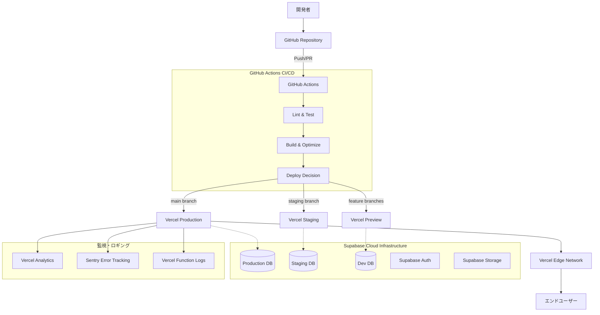

# インフラ・デプロイ・CI/CD 詳細計画書

**プロジェクト**: Hair Application  
**Issue**: #7 インフラ・デプロイ・CI/CD  
**期間**: 2-3週間  
**担当**: DevOpsエンジニア 1名 + インフラエンジニア 1名  
**最終更新**: 2026-03-20

## 1. プロジェクト概要

### 1.1 目標
- Vercel + Supabase Cloudを活用した堅牢なインフラストラクチャの構築
- 3環境（dev/staging/production）での自動デプロイパイプライン
- 包括的な監視・ロギング・セキュリティ体制の確立
- 高パフォーマンスなWebアプリケーションの実現

### 1.2 技術スタック
- **フロントエンド**: Next.js (Vercelでホスティング)
- **バックエンド**: Supabase Cloud (PostgreSQL + Auth + API)
- **CI/CD**: GitHub Actions
- **監視**: Vercel Analytics + Sentry
- **セキュリティ**: Vercel Edge Config + CSP

## 2. アーキテクチャ構成図



## 3. 環境構成詳細

### 3.1 Development環境
```yaml
# 開発環境
Environment: development
Domain: hair-dev-*.vercel.app (Preview URLs)
Supabase Project: hair-development
Purpose: 機能開発・テスト
Auto-Deploy: feature/dev branches
```

### 3.2 Staging環境
```yaml
# ステージング環境
Environment: staging
Domain: hair-staging.vercel.app
Supabase Project: hair-staging
Purpose: 本番前テスト・QA
Auto-Deploy: staging branch
```

### 3.3 Production環境
```yaml
# 本番環境
Environment: production
Domain: hair.example.com (カスタムドメイン)
Supabase Project: hair-production
Purpose: 本番運用
Auto-Deploy: main branch (手動承認付き)
```

## 4. GitHub Actions CI/CDパイプライン

### 4.1 ワークフロー構成

#### 4.1.1 メインワークフロー (.github/workflows/ci-cd.yml)
```yaml
name: CI/CD Pipeline

on:
  push:
    branches: [main, staging, develop]
  pull_request:
    branches: [main, staging]

jobs:
  # 品質チェック
  quality-check:
    runs-on: ubuntu-latest
    steps:
      - uses: actions/checkout@v4
      - name: Setup Node.js
        uses: actions/setup-node@v4
        with:
          node-version: '18'
          cache: 'npm'
      
      - name: Install dependencies
        run: npm ci
      
      - name: ESLint
        run: npm run lint
      
      - name: TypeScript Check
        run: npm run type-check
      
      - name: Unit Tests
        run: npm run test
      
      - name: E2E Tests (Staging only)
        if: github.ref == 'refs/heads/staging'
        run: npm run test:e2e

  # セキュリティチェック
  security-scan:
    runs-on: ubuntu-latest
    steps:
      - uses: actions/checkout@v4
      - name: Run Trivy vulnerability scanner
        uses: aquasecurity/trivy-action@master
        with:
          scan-type: 'fs'
          scan-ref: '.'
      
      - name: Dependency Check
        run: npm audit --audit-level moderate

  # ビルド・デプロイ
  deploy:
    needs: [quality-check, security-scan]
    runs-on: ubuntu-latest
    steps:
      - uses: actions/checkout@v4
      
      # Production Deploy (main branch)
      - name: Deploy to Production
        if: github.ref == 'refs/heads/main'
        uses: amondnet/vercel-action@v25
        with:
          vercel-token: ${{ secrets.VERCEL_TOKEN }}
          vercel-org-id: ${{ secrets.VERCEL_ORG_ID }}
          vercel-project-id: ${{ secrets.VERCEL_PROJECT_ID }}
          vercel-args: '--prod'
          working-directory: ./
      
      # Staging Deploy (staging branch)
      - name: Deploy to Staging
        if: github.ref == 'refs/heads/staging'
        uses: amondnet/vercel-action@v25
        with:
          vercel-token: ${{ secrets.VERCEL_TOKEN }}
          vercel-org-id: ${{ secrets.VERCEL_ORG_ID }}
          vercel-project-id: ${{ secrets.VERCEL_PROJECT_ID_STAGING }}
          working-directory: ./

  # パフォーマンステスト
  performance-test:
    needs: deploy
    if: github.ref == 'refs/heads/staging' || github.ref == 'refs/heads/main'
    runs-on: ubuntu-latest
    steps:
      - uses: actions/checkout@v4
      - name: Lighthouse CI
        uses: treosh/lighthouse-ci-action@v10
        with:
          configPath: './.lighthouserc.json'
          uploadArtifacts: true
          temporaryPublicStorage: true
```

#### 4.1.2 データベースマイグレーション (.github/workflows/db-migration.yml)
```yaml
name: Database Migration

on:
  workflow_dispatch:
    inputs:
      environment:
        description: 'Target Environment'
        required: true
        type: choice
        options:
          - development
          - staging
          - production

jobs:
  migrate:
    runs-on: ubuntu-latest
    environment: ${{ github.event.inputs.environment }}
    steps:
      - uses: actions/checkout@v4
      
      - name: Setup Supabase CLI
        uses: supabase/setup-cli@v1
        with:
          version: latest
      
      - name: Run Migrations
        run: |
          supabase db push --db-url ${{ secrets.SUPABASE_DB_URL }}
        env:
          SUPABASE_ACCESS_TOKEN: ${{ secrets.SUPABASE_ACCESS_TOKEN }}
```

### 4.2 必要なGitHubシークレット

```yaml
# Vercel関連
VERCEL_TOKEN: "vercel_xxx"
VERCEL_ORG_ID: "team_xxx"
VERCEL_PROJECT_ID: "prj_xxx" # Production
VERCEL_PROJECT_ID_STAGING: "prj_xxx" # Staging

# Supabase関連
SUPABASE_ACCESS_TOKEN: "sbp_xxx"
SUPABASE_DB_URL_DEV: "postgresql://xxx"
SUPABASE_DB_URL_STAGING: "postgresql://xxx"
SUPABASE_DB_URL_PROD: "postgresql://xxx"

# Monitoring関連
SENTRY_DSN: "https://xxx@sentry.io/xxx"
SENTRY_AUTH_TOKEN: "xxx"
```

## 5. Vercel設定詳細

### 5.1 vercel.json設定
```json
{
  "version": 2,
  "builds": [
    {
      "src": "package.json",
      "use": "@vercel/next"
    }
  ],
  "env": {
    "NEXT_PUBLIC_SUPABASE_URL": "@supabase-url",
    "NEXT_PUBLIC_SUPABASE_ANON_KEY": "@supabase-anon-key",
    "SUPABASE_SERVICE_ROLE_KEY": "@supabase-service-role"
  },
  "headers": [
    {
      "source": "/(.*)",
      "headers": [
        {
          "key": "Content-Security-Policy",
          "value": "default-src 'self'; script-src 'self' 'unsafe-eval' 'unsafe-inline' *.vercel.app *.supabase.co; style-src 'self' 'unsafe-inline'; img-src 'self' data: *.supabase.co; connect-src 'self' *.supabase.co *.sentry.io"
        },
        {
          "key": "X-Frame-Options",
          "value": "DENY"
        },
        {
          "key": "X-Content-Type-Options",
          "value": "nosniff"
        },
        {
          "key": "Referrer-Policy",
          "value": "strict-origin-when-cross-origin"
        },
        {
          "key": "Strict-Transport-Security",
          "value": "max-age=31536000; includeSubDomains"
        }
      ]
    }
  ],
  "rewrites": [
    {
      "source": "/api/:path*",
      "destination": "/api/:path*"
    }
  ]
}
```

### 5.2 環境変数管理
```bash
# Production
vercel env add NEXT_PUBLIC_SUPABASE_URL production
vercel env add NEXT_PUBLIC_SUPABASE_ANON_KEY production
vercel env add SUPABASE_SERVICE_ROLE_KEY production
vercel env add SENTRY_DSN production

# Staging
vercel env add NEXT_PUBLIC_SUPABASE_URL staging
# ... (同様にstaging環境用の値を設定)
```

## 6. Supabase Cloud設定

### 6.1 プロジェクト構成
```sql
-- 各環境での基本設定

-- RLS (Row Level Security) 設定例
ALTER TABLE profiles ENABLE ROW LEVEL SECURITY;

CREATE POLICY "Users can view own profile" 
  ON profiles FOR SELECT 
  USING (auth.uid() = id);

CREATE POLICY "Users can update own profile" 
  ON profiles FOR UPDATE 
  USING (auth.uid() = id);
```

### 6.2 認証設定
```javascript
// supabase/client.js
import { createClient } from '@supabase/supabase-js'

const supabaseUrl = process.env.NEXT_PUBLIC_SUPABASE_URL
const supabaseAnonKey = process.env.NEXT_PUBLIC_SUPABASE_ANON_KEY

export const supabase = createClient(supabaseUrl, supabaseAnonKey, {
  auth: {
    autoRefreshToken: true,
    persistSession: true,
    detectSessionInUrl: true
  }
})
```

## 7. 監視・ロギング設定

### 7.1 Sentry設定
```javascript
// sentry.client.config.js
import * as Sentry from '@sentry/nextjs'

const SENTRY_DSN = process.env.SENTRY_DSN || process.env.NEXT_PUBLIC_SENTRY_DSN

Sentry.init({
  dsn: SENTRY_DSN,
  environment: process.env.NODE_ENV,
  tracesSampleRate: 1.0,
  beforeSend(event) {
    if (event.exception) {
      const error = event.exception.values?.[0]
      console.error('Sentry Error:', error)
    }
    return event
  },
  integrations: [
    new Sentry.BrowserTracing({
      routingInstrumentation: Sentry.nextRouterInstrumentation(router)
    })
  ]
})
```

### 7.2 パフォーマンス監視
```json
// .lighthouserc.json
{
  "ci": {
    "assert": {
      "assertions": {
        "categories:performance": ["warn", {"minScore": 0.85}],
        "first-contentful-paint": ["error", {"maxNumericValue": 1500}],
        "largest-contentful-paint": ["error", {"maxNumericValue": 2500}],
        "interactive": ["error", {"maxNumericValue": 3000}],
        "cumulative-layout-shift": ["warn", {"maxNumericValue": 0.1}]
      }
    },
    "upload": {
      "target": "temporary-public-storage"
    }
  }
}
```

## 8. セキュリティ設定

### 8.1 環境変数暗号化
```bash
# 機密情報の暗号化スクリプト
#!/bin/bash
# encrypt-secrets.sh

echo "Encrypting environment variables..."

# GPG暗号化
gpg --symmetric --cipher-algo AES256 --output .env.production.gpg .env.production
gpg --symmetric --cipher-algo AES256 --output .env.staging.gpg .env.staging

echo "Environment variables encrypted successfully"
```

### 8.2 CSP (Content Security Policy) 強化
```javascript
// next.config.js
const ContentSecurityPolicy = `
  default-src 'self';
  script-src 'self' ${process.env.NODE_ENV === 'development' ? "'unsafe-eval'" : ''};
  style-src 'self' 'unsafe-inline';
  img-src 'self' data: *.supabase.co;
  font-src 'self';
  connect-src 'self' *.supabase.co *.sentry.io;
  frame-ancestors 'none';
`

const securityHeaders = [
  {
    key: 'Content-Security-Policy',
    value: ContentSecurityPolicy.replace(/\s{2,}/g, ' ').trim()
  },
  {
    key: 'X-Frame-Options',
    value: 'DENY'
  },
  {
    key: 'X-Content-Type-Options',
    value: 'nosniff'
  },
  {
    key: 'Referrer-Policy',
    value: 'strict-origin-when-cross-origin'
  }
]

module.exports = {
  async headers() {
    return [
      {
        source: '/(.*)',
        headers: securityHeaders,
      },
    ]
  },
}
```

## 9. パフォーマンス最適化戦略

### 9.1 Next.js最適化設定
```javascript
// next.config.js
module.exports = {
  experimental: {
    optimizeCss: true,
    serverActions: true
  },
  compiler: {
    removeConsole: process.env.NODE_ENV === 'production'
  },
  images: {
    domains: ['*.supabase.co'],
    formats: ['image/webp', 'image/avif']
  },
  async rewrites() {
    return [
      {
        source: '/api/:path*',
        destination: '/api/:path*'
      }
    ]
  }
}
```

### 9.2 Bundle分析設定
```json
{
  "scripts": {
    "analyze": "cross-env ANALYZE=true next build",
    "analyze:server": "cross-env BUNDLE_ANALYZE=server next build",
    "analyze:browser": "cross-env BUNDLE_ANALYZE=browser next build"
  }
}
```

### 9.3 キャッシュ戦略
```javascript
// Cache-Control設定
export const config = {
  matcher: [
    '/((?!api|_next/static|_next/image|favicon.ico).*)',
  ],
}

export function middleware(request) {
  const response = NextResponse.next()
  
  // 静的アセットのキャッシュ
  if (request.nextUrl.pathname.startsWith('/_next/static/')) {
    response.headers.set('Cache-Control', 'public, max-age=31536000, immutable')
  }
  
  return response
}
```

## 10. 実装スケジュール（2-3週間）

### 第1週: インフラ基盤構築
**Day 1-2: 環境セットアップ**
- [ ] Vercelプロジェクト作成（3環境）
- [ ] Supabase Cloudプロジェクト作成（3環境）
- [ ] ドメイン・DNS設定
- [ ] SSL証明書設定

**Day 3-4: CI/CDパイプライン**
- [ ] GitHub Actionsワークフロー作成
- [ ] シークレット管理設定
- [ ] ブランチ戦略実装
- [ ] 自動テスト設定

**Day 5-7: セキュリティ実装**
- [ ] CSP設定
- [ ] 環境変数暗号化
- [ ] セキュリティヘッダー設定
- [ ] 脆弱性スキャン設定

### 第2週: 監視・パフォーマンス
**Day 8-10: 監視システム**
- [ ] Sentry統合
- [ ] Vercel Analytics設定
- [ ] ログ集約システム
- [ ] アラート設定

**Day 11-12: パフォーマンス最適化**
- [ ] Lighthouse CI設定
- [ ] Bundle分析設定
- [ ] キャッシュ戦略実装
- [ ] 画像最適化

**Day 13-14: テスト・検証**
- [ ] 全環境テスト
- [ ] パフォーマンステスト
- [ ] セキュリティテスト
- [ ] 障害対応テスト

### 第3週: ドキュメント・運用
**Day 15-17: ドキュメント作成**
- [ ] 運用手順書作成
- [ ] トラブルシューティングガイド
- [ ] APIドキュメント
- [ ] チーム向け研修資料

**Day 18-21: 本番移行準備**
- [ ] 本番データマイグレーション
- [ ] DNSカットオーバー計画
- [ ] ロールバック手順確認
- [ ] 最終検証

## 11. 運用・保守計画

### 11.1 日常監視項目
- アプリケーションヘルスチェック
- パフォーマンスメトリクス監視
- エラー率監視
- セキュリティアラート監視

### 11.2 定期メンテナンス
- 依存関係更新 (月次)
- セキュリティパッチ適用 (週次)
- パフォーマンス分析レポート (月次)
- バックアップ検証 (週次)

### 11.3 緊急対応手順
1. アラート受信
2. 影響範囲調査
3. 一次対応実施
4. 根本原因分析
5. 恒久対策実施

## 12. 成功指標・KPI

### 12.1 パフォーマンス指標
- **FCP (First Contentful Paint)**: < 1.5秒
- **LCP (Largest Contentful Paint)**: < 2.5秒
- **TTI (Time to Interactive)**: < 3秒
- **CLS (Cumulative Layout Shift)**: < 0.1

### 12.2 可用性指標
- **Uptime**: 99.9%以上
- **MTTR (Mean Time to Recovery)**: < 15分
- **デプロイ成功率**: 95%以上

### 12.3 セキュリティ指標
- **脆弱性検出**: 0件（Critical/High）
- **セキュリティインシデント**: 0件
- **SSL/TLS設定**: A+評価

## 13. リスク管理

### 13.1 技術リスク
| リスク | 影響度 | 確率 | 対策 |
|--------|--------|------|------|
| Vercel障害 | 高 | 低 | CDN冗長化検討 |
| Supabase障害 | 高 | 低 | バックアップ強化 |
| 依存関係脆弱性 | 中 | 中 | 自動スキャン実装 |

### 13.2 運用リスク
| リスク | 影響度 | 確率 | 対策 |
|--------|--------|------|------|
| 不適切なデプロイ | 高 | 中 | 承認フロー強化 |
| 設定ミス | 中 | 中 | IaC化推進 |
| キー漏洩 | 高 | 低 | シークレット管理強化 |

## 14. 費用見積もり

### 14.1 月次運用費用
```
Vercel Pro: $240/月
Supabase Pro (3環境): $75/月
Sentry: $26/月
ドメイン・SSL: $10/月
---
合計: 約$351/月 (約50,000円/月)
```

### 14.2 初期構築費用
```
DevOpsエンジニア: 3週間 × $1,000/日 = $15,000
インフラエンジニア: 2週間 × $800/日 = $8,000
---
合計: $23,000 (約330万円)
```

---

この計画書は、Vercel + Supabase Cloudを活用した堅牢で拡張性の高いインフラストラクチャの構築を目指しています。セキュリティ、パフォーマンス、運用性を重視した設計となっており、2-3週間での実装が可能な実践的な計画となっています。

**担当者**: DevOpsエンジニア 1名 + インフラエンジニア 1名  
**承認**: プロダクトマネージャー、CTOの承認が必要  
**次回レビュー**: 実装開始後1週間後